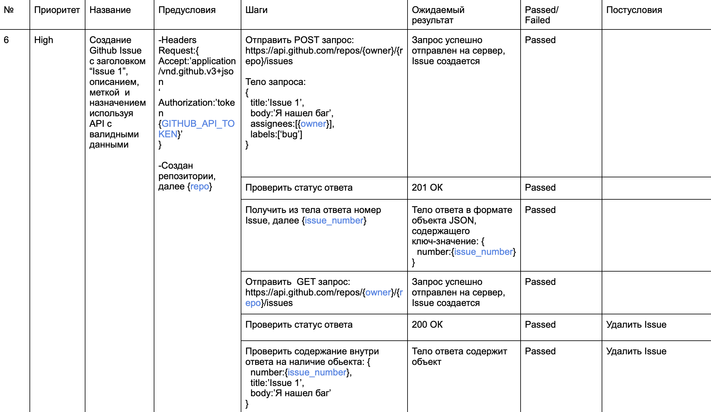
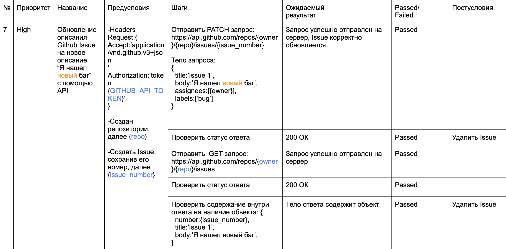
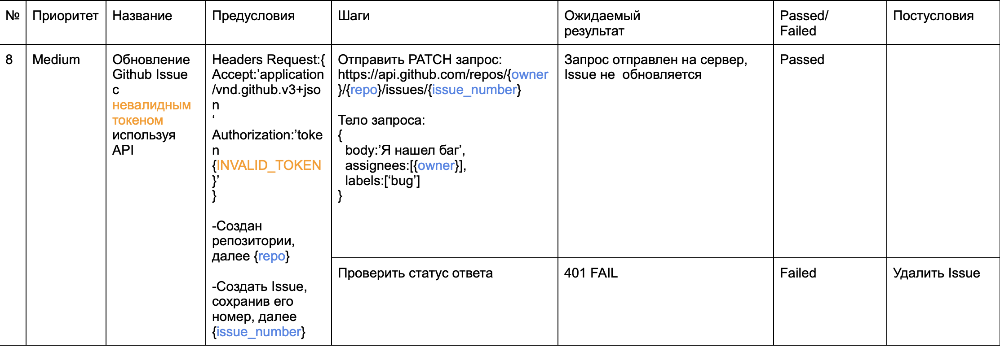
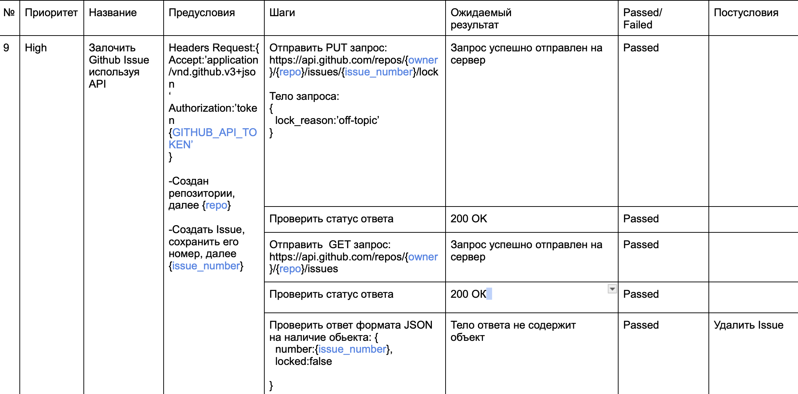
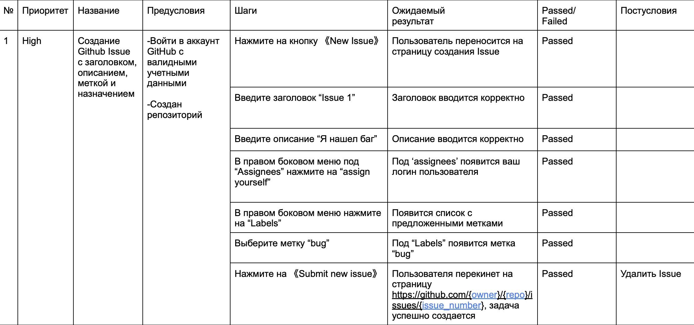
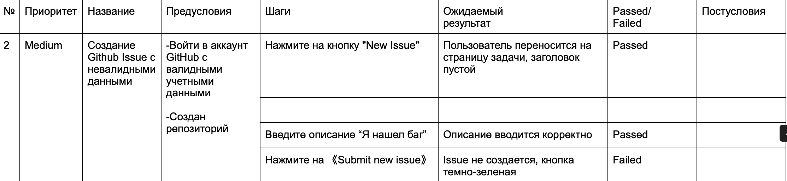
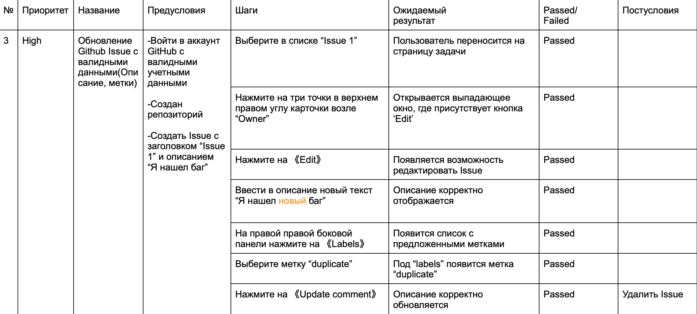
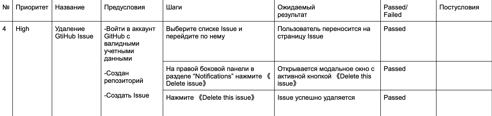
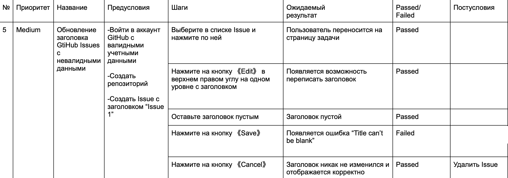

# Github Issues

## Environment
```
Device: Mac M1
    OS: macOs Ventura 13.0
NodeJS: v18.16.1
```
## Build
Чтобы установить необходимый пакет библиотек используйте команду: `make build`

В качестве сторонних библиотек были использованы:
```
> Playwright
> otpauth
> allure-playwright
> allure-commandline
> dotenv
```

## Test
Чтобы прогнать тесты используйте команду: `make test`

## Allure Report
Чтобы получить отчет о ходе тестирования используйте команду: `make show-report`


## Тест Кейсы

### API





## UI





